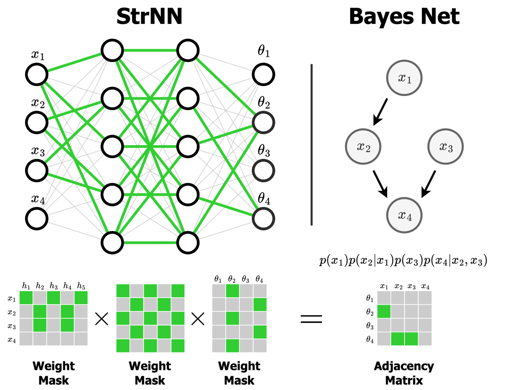

# Structured Neural Networks

**Official implementation of the NeurIPS 2023 paper [Structured Neural Networks for Density Estimation and Causal Inference](https://arxiv.org/abs/2311.02221).**
<p align="center">

</p>

## Introduction

We introduce the **Structured Neural Network (StrNN)**, a network architecture that enforces functional independence relationships between inputs and outputs via weight masking. This is an efficient way to inject prior assumed structure into arbitrary neural networks, which could lead to applications in improved density estimation, generative modelling, and causal inference. 

## Setup
The StrNN can be installed using `pip install strnn`. 

If you are interested in reproducing our flow experiments, we instead recommend using an editable install. To do so, clone this repository and then run `pip install -e .` The flow experiments in the paper can be reproduced using `torch==2.0.1` with cuda version 11.7.

## Quick Start

The StrNN provides a drop-in replacement for a fully connected neural network, allowing it to respect prescribed functional independencies.
For example, given an adjacency matrix $A$, we can initialize an StrNN as such:

```
import numpy as np
import torch
from strnn.models.strNN import StrNN

A = np.array([
    [0, 0, 0, 0],
    [1, 0, 0, 0],
    [0, 1, 0, 0],
    [1, 0, 1, 0]
])

out_dim = A.shape[0]
in_dim = A.shape[1]
hid_dim = (50, 50)

strnn = StrNN(in_dim, hid_dim, out_dim, opt_type="greedy", adjacency=A)

x = torch.randn(in_dim)
y = strnn(x)
```
The most important parameter to the StrNN class here is `opt_type`, which specifies how the StrNN factorizes the adjacency matrix into weight masks, dictating which paths are zeroed out in the resulting masked neural network. We currently support three factorization options:
1. Greedy: Algorithm 1 in the paper; an efficient greedy algorithm that approximates the optimization objective (Equation 2) but keeps *zero reconstruction loss* when it comes to the sparsity pattern of adjacency matrix $A$.
2. Zuko: a similar approximate algorithm inspired by [this repo](https://github.com/francois-rozet/zuko).
3. MADE: baseline algorithm from Germain et al that only supports the fully autoregressive structure.

The StrNN can be used to improve density estimation capabilities when an adjacency structure is known for the task, for example when integrated into normalizing flows, as we show in the experiments below.

## Examples

Scripts to reproduce all experiments from the paper can be found in the `/experiments` folder. Here we provide some code examples on how StrNN can be used.

### Binary Density Estimation with StrNN

The StrNN can be directly used to perform density estimation on binary or Gaussian data, similar to how MADE was used in Germain et al. In fact, the StrNN density estimator class in `models/strNNDensityEstimator.py` can be used for density estimation wehenver we have a closed parametric form in mind for the data generating process, although this is seldom the case in practice. The training script and sample experiment configs for this basic density estimator can be found under `/experiments/binary_and_gaussian/`. Use the following command to reproduce one of the binary experiments from our paper: 
```
python run_binary_experiment.py --experiment_name binary_random_sparse_d15_n2000_StrNN_best --wandb_name strnn
```

### Density Estimation with Structured Normalizing Flows
The StrNN can be integrated into Normalizing Flow architectures for more complex density estimation tasks. We insert the StrNN into autoregressive flows and continuous normalizing flows. It replaces the feed forward networks used to represent the conditioner and flow dynamics, respectively, allowing them to respect known structure. An example to initialize these flow estimators are shown below. Baseline flows are also implemented. 
```
import numpy as np
import torch

from strnn.models.discrete_flows import AutoregressiveFlowFactory
from strnn.models.continuous_flows import ContinuousFlowFactory

A = np.array([
    [0, 0, 0, 0],
    [1, 0, 0, 0],
    [0, 1, 0, 0],
    [1, 0, 1, 0]
])

af_config = {
    "input_dim": A.shape[0],
    "adjacency_matrix": A,
    "base_model": "ANF",
    "opt_type": "greedy",
    "opt_args": {},
    "conditioner_type": "strnn",
    "conditioner_hid_dim": [50, 50],
    "conditioner_act_type": "relu",
    "normalizer_type": "umnn",
    "umnn_int_solver": "CC",
    "umnn_int_step": 20,
    "umnn_int_hid_dim": [50, 50],
    "flow_steps": 10,
    "flow_permute": False,
    "n_param_per_var": 25
}

straf = AutoregressiveFlowFactory(af_config).build_flow()

x = torch.randn(1, A.shape[0])
z, jac = straf(x)
x_bar = straf.invert(z)


cnf_config = {...} # See model_config.yaml for values
strcnf = ContinuousFlowFactory(cnf_config).build_flow()
z, jac = strcnf(x)
x_bar = strcnf.invert(z)
```

See `experiments/synthetic_multimodal/config/model_config.yaml` for config values used in the paper experiments. 

The flow experiments from the paper are reproducible using `experiments/synthetic_multimodal/run_experiment_mm.py`. After performing a editable install of this repository, we can run:

```
python run_experiment_mm.py --dataset_name multimodal --model_config straf_best --wandb_name strnn --model_seed 2541  --lr 1e-3 --scheduler plateau
```

Hyperparameter values / grids are available in the paper appendix. Note that we must modify the adjacency matrix to include the main diagonal for the StrCNF to work well. The CIs are generated using model seeds: `[2541 2547 412 411 321 3431 4273 2526]`.

## Citation

Please use the following citation if you use this code or methods in your own work.

```bibtex
@inproceedings{
    chen2023structured,
    title = {Structured Neural Networks for Density Estimation and Causal Inference},
    author = {Asic Q Chen, Ruian Shi, Xiang Gao, Ricardo Baptista, Rahul G Krishnan},
    booktitle = {Thirty-seventh Conference on Neural Information Processing Systems},
    year = {2023},
    url = {https://arxiv.org/abs/2311.02221}
}
```

